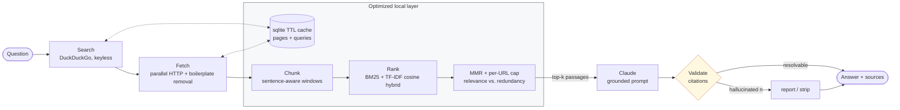

# Eris

[](https://github.com/arhammxo/eris/actions/workflows/ci.yml)
[](https://www.python.org/downloads/)
[](https://www.anthropic.com/claude)
[](https://github.com/astral-sh/ruff)
[](LICENSE)

**An LLM augmented with real-time web search for up-to-date answers, with an optimized local retrieval layer.**

Eris searches the live web, fetches the pages, ranks the passages locally with a BM25/TF-IDF hybrid, diversifies them with MMR, and asks Claude to answer using only those passages — with citations it then verifies.

```console
$ eris ask "How does Python 3.13 change the global interpreter lock?" -v
Python 3.13 ships an experimental free-threaded build in which the global interpreter
lock is disabled, selected at compile time with the --disable-gil flag [1]. Threads can
then execute bytecode in parallel across cores, but C extensions must be rebuilt and
audited for thread safety, and single-threaded performance is measurably slower [1].
The design rationale, including biased reference counting, is set out in PEP 703 [2].

Sources:
  [1] What's New In Python 3.13
      https://docs.python.org/3.13/whatsnew/3.13.html
  [2] PEP 703 - Making the GIL Optional
      https://peps.python.org/pep-0703/

stages: search=412.7ms  fetch=884.1ms  retrieve=18.3ms  answer=2140.6ms
total: 3455.7ms  search_results=8  documents=6  chunks=6
```

*Illustrative — this path needs a live API key and network. The verified, reproducible outputs in this README are the [offline `ask` run](#eris-ask-question), the [cache stats](#eris-cache) and the [eval harness](#eval-harness), all captured from this repo.*

---

## Why

**An LLM alone cannot answer this.** Model weights are frozen at a training cutoff, so anything after it — a release, an incident, a price, a policy change — is either refused or, worse, confabulated with total fluency. Search fixes the recency problem.

**But search alone is not enough, and stuffing raw pages is the wrong fix.** The naive approach is to concatenate the top few results into the prompt. That fails three ways:

1. **Signal dilution.** A fetched page is mostly navigation, cookie banners, related-article rails and footers. The sentence that answers the question is a rounding error in the token count, and attention has to find it in the noise.
2. **Budget waste.** Eight pages of raw HTML is comfortably six figures of tokens. You pay for it, you wait for it, and most of it is markup.
3. **No attribution.** If everything arrives as one undifferentiated blob, the model cannot tell you *which* source a claim came from, and you cannot check it.

**So Eris does the ranking itself, before the model sees anything.** Extract article text, split it into passages, score those passages against the question, and spend the context budget on the six that actually matter. Local ranking costs single-digit milliseconds and no API call: measured on this repo's fixtures, the `retrieve` stage takes 8.6ms. Against a model call in the seconds, that is a rounding error relative to what it saves.

Then the part most RAG demos skip: **verify the citations.** The prompt instructs the model to cite `[n]` and to admit when the sources fall short, but an instruction is a request, not a guarantee. Eris parses every marker out of the reply and resolves it against the context it actually supplied. A hallucinated `[9]` against six sources is caught, reported on the result, and can be stripped from the text.

---

## Architecture



The cache sits *in front of* both network stages, so a repeated question skips search and fetch entirely. That is what makes `--no-web` possible: with a warm cache, Eris answers with no network access at all.

---

## Quickstart

```bash
git clone git@github.com:arhammxo/eris.git
cd eris
pip install -e '.[all]'          # or: pip install -e .  (base install, see Extras)

export ERIS_ANTHROPIC_API_KEY=...   # or copy .env.example to .env
eris ask "What changed in the latest Python release?"
```

No key, no network? The eval harness runs fully offline:

```bash
eris eval examples/qa.jsonl
```

### Library use

```python
from eris import Eris

with Eris() as eris:
    result = eris.ask("What is the current maximum Lambda package size?")
    print(result.answer.text)

    for citation in result.answer.citations:
        print(f"[{citation.n}] {citation.url}")

    print(result.timing_map())  # {'search': 402.1, 'fetch': 861.3, ...}
    print(result.answer.invalid_citations)  # () when the model behaved
```

Every collaborator is injectable, which is how the test suite runs the real pipeline with no I/O:

```python
from eris import Eris, FakeSearch, StaticFetcher, NullCache, FakeClient, load_settings

eris = Eris(
    load_settings(search_backend="fake"),
    search_backend=FakeSearch({"my question": results}),
    fetcher=StaticFetcher(documents),
    cache=NullCache(),
    llm_client=FakeClient(["A grounded answer [1]."]),
)
```

### Extras

The base install has five dependencies and works on its own; each extra upgrades one stage.

| Extra | Adds | Without it |
|---|---|---|
| `search` | `ddgs` — keyless web search | `DuckDuckGoSearch` raises a clear install error |
| `extract` | `trafilatura`, `beautifulsoup4` | falls back to a regex extractor |
| `tfidf` | `scikit-learn` — cosine scorer | ranking runs BM25-only |
| `llm` | `anthropic` | `AnthropicClient` raises a clear install error |
| `all` | all of the above | — |

---

## Configuration

Every setting is read from the environment (or `.env`) with the `ERIS_` prefix, validated by `pydantic-settings`. The API key is a `SecretStr`, optional at import, and never logged.

| Variable | Default | Purpose |
|---|---|---|
| `ERIS_ANTHROPIC_API_KEY` | — | Anthropic key. Required only for real model calls. |
| `ERIS_MODEL` | `claude-sonnet-4-5` | Claude model id. |
| `ERIS_MAX_TOKENS` | `1024` | Cap on generated tokens. |
| `ERIS_TEMPERATURE` | `0.0` | Kept at 0 so grounded answers reproduce. |
| `ERIS_SEARCH_BACKEND` | `duckduckgo` | `duckduckgo` or `fake`. |
| `ERIS_MAX_RESULTS` | `8` | Search results requested per query. |
| `ERIS_FETCH_TIMEOUT_S` | `10.0` | Per-request HTTP timeout. |
| `ERIS_MAX_PAGE_BYTES` | `2000000` | Hard cap on downloaded bytes per page. |
| `ERIS_FETCH_CONCURRENCY` | `8` | Parallel page fetches. |
| `ERIS_USER_AGENT` | `eris/0.1 (+…)` | Sent on every request so operators can identify us. |
| `ERIS_CACHE_DIR` | `./data/cache` | Directory holding the sqlite cache. |
| `ERIS_CACHE_TTL_S` | `3600` | Entry lifetime. `0` disables caching. |
| `ERIS_TOP_K` | `6` | Passages handed to the model. |
| `ERIS_CHUNK_SIZE` | `1200` | Chunk size, characters. |
| `ERIS_CHUNK_OVERLAP` | `200` | Overlap across the chunk seam. |
| `ERIS_BM25_WEIGHT` | `0.65` | Hybrid weight. `1.0` = BM25 only. |
| `ERIS_MMR_LAMBDA` | `0.7` | `1.0` = pure relevance, `0.0` = pure diversity. |
| `ERIS_MAX_CHUNKS_PER_URL` | `2` | Stops one page owning the context. |
| `ERIS_LOG_LEVEL` | `WARNING` | Applied to the `eris` logger only. |

---

## CLI reference

### `eris ask QUESTION`

| Flag | Effect |
|---|---|
| `--top-k N` | Passages to retrieve. |
| `--max-results N` | Search results to request. |
| `--search-backend {duckduckgo,fake}` | Override the backend. |
| `--model ID` | Override the Claude model. |
| `--no-web` | Answer from the cache only: no search, no fetch, no network. |
| `--no-cache` | Bypass the cache for reads and writes. |
| `--json` | Emit the full result, including timings, as JSON. |
| `--scores` | Show the retrieval score of each passage. |
| `--strip-hallucinated` | Remove citation markers that do not resolve. |
| `-v, --verbose` | Show per-stage timings. |

```console
$ eris ask "How does Python 3.13 change the global interpreter lock?" --no-web -v
Based on the retrieved sources: [1] [2] [3]

Sources:
  [1] What's New In Python 3.13
      https://docs.python.org/3.13/whatsnew/3.13.html
  [2] What's New In Python 3.13
      https://docs.python.org/3.13/whatsnew/3.13.html
  [3] PEP 703 - Making the GIL Optional
      https://peps.python.org/pep-0703

stages: cache=1.2ms  retrieve=8.6ms  answer=0.1ms
total: 9.9ms  documents=2  chunks=3
```

*(Run against a warm cache with a stub model, to show the offline path and its timings without a live API call. Total wall time 9.9ms — the cache is doing the work.)*

### `eris cache`

| Flag | Effect |
|---|---|
| `--stats` | Show statistics (default action). |
| `--clear` | Delete every entry. |
| `--purge` | Delete only expired entries. |
| `--json` | Emit statistics as JSON. |

```console
$ eris cache --stats
path:      /tmp/eris-demo/eris.sqlite3
ttl:       3600s
pages:     2 fresh, 0 expired
searches:  0 fresh, 0 expired
size:      0.03 MB
```

### `eris eval PATH`

| Flag | Effect |
|---|---|
| `--top-k N` | Context size to evaluate at. |
| `--json` | Emit the report as JSON. |
| `--strict` | Exit non-zero unless both metrics are 100%. Used in CI. |

---

## Eval harness

It is easy to convince yourself a retriever works. The harness makes it checkable. Each case in `examples/qa.jsonl` supplies its own fake search results and page bodies, so the run is deterministic and needs neither a key nor a socket — but the chunker, ranker, MMR selector and citation validator are all the real ones.

Every case includes at least one **distractor**: a source that is topically adjacent but does not answer the question. Without distractors, hit-rate measures nothing, because any ranker scores 100% when every candidate is correct.

Two metrics, deliberately independent:

- **hit-rate@k** — did the passage containing the answer reach the context window? This grades retrieval. If it drops, ranking regressed.
- **citation validity** — did every `[n]` in the reply resolve to a real source? This grades the guardrail.

Real output, from `eris eval examples/qa.jsonl` on this repo:

```console
$ eris eval examples/qa.jsonl
  #  question                                                    hit@k   cites   chunks
---------------------------------------------------------------------------------------
  1  What did Python 3.13 change about the global interpreter …   PASS     ok         3
  2  How much did the Voyager 1 spacecraft weigh at launch?       PASS     ok         2
  3  What is the maximum request payload size for the service …   PASS     ok         3
  4  Which cities host the organisation's primary data centres?   PASS     ok         2
  5  What caused the 2024 service outage on the write path?       PASS     ok         2
  6  What is the recommended way to rotate the signing key?       PASS     ok         2
---------------------------------------------------------------------------------------
cases=6  top_k=6  hit_rate@6=100.0%  citation_validity=100.0%
```

The stricter run is the more informative one. At `--top-k 1` the ranker gets a single passage of context, so it has to place the answering passage *first* out of every chunk of every source:

```console
$ eris eval examples/qa.jsonl --top-k 1
...
cases=6  top_k=1  hit_rate@1=100.0%  citation_validity=100.0%
```

CI runs `--strict`, so a ranking regression fails the build rather than quietly degrading answer quality.

---

## Design notes

**Why BM25, and why implement it.** Okapi BM25 beats plain TF-IDF on short natural-language questions for two reasons. *Term saturation*: the fourth occurrence of a keyword adds much less than the second, so a keyword-stuffed passage cannot dominate. *Length normalisation*: a long passage does not win merely by containing more words. It is about forty lines of numpy, so a dependency on a heavyweight vector store or embedding service would buy nothing here.

There is a test that measures this rather than asserting it — `test_cosine_rewards_keyword_stuffing_more_than_bm25` compares how much a stuffed passage gains under each scorer, and confirms cosine is the more credulous of the two. That is why BM25 carries the larger share of the hybrid by default.

**Why a hybrid at all.** BM25 and TF-IDF cosine fail differently: sublinear TF with L2 normalisation reacts to term overlap in a way that saturation does not. Blending them (after independently min-max normalising each, so the weight means what it says) is more robust than either alone. It is optional — without `scikit-learn`, Eris runs BM25-only and says so at debug level rather than failing.

**Why MMR.** Ranking by relevance alone tends to return five paraphrases of the same paragraph, because the passage that best matches the query is usually adjacent to several near-copies. MMR makes redundancy expensive: at each step it maximises `λ·relevance − (1−λ)·similarity-to-already-selected`. A per-URL cap sits on top as a hard guarantee, since MMR only *discourages* redundancy. When the cap would leave the context underfilled, it relaxes — spending the budget beats returning a short list, and there is a test for each behaviour.

**Why a TTL cache, in sqlite.** Fetching dominates the online path — it is the only stage doing bulk network I/O, across up to eight pages — while ranking is single-digit milliseconds. A repeat question should not re-crawl: the verified offline run above answers in 9.9ms end to end. Keys are normalised URLs, so `HTTP://Example.com/a?utm_source=x#frag` and `http://example.com/a` share one entry. sqlite comes from the standard library, gives atomic cross-process writes, and needs no daemon. A TTL rather than permanent storage because the whole premise is *current* answers — a stale cache would reintroduce the knowledge-cutoff problem it exists to solve.

**Failure is expected, not exceptional.** Search rate-limits, links rot, pages return PDFs. Search failure falls back to the cache; a dead link is skipped rather than sinking the batch; a cache write failure never fails a query. When nothing at all can be retrieved, Eris says so instead of letting the model improvise — with no context, the model is not called at all.

**What is fake in the tests, and what is not.** 568 tests, no network, no API key, no sleeping. Substituted at three seams only: `FakeSearch` for the search backend, `StaticFetcher` (or an `httpx.MockTransport`) for HTTP, and `FakeClient` / `EchoCitationClient` for the model. Everything else is production code — real chunking, real BM25, real MMR, real sqlite, real citation validation, real Click commands. A `conftest` fixture monkeypatches `socket.connect` to fail, so a regression that reintroduces a live call is caught rather than merely slow. TTL expiry is tested with an injected clock, so the suite finishes in about five seconds.

Three bugs in this repo were found by its own tests rather than by review: an over-aggressive text filter that silently dropped single-character content lines, a `zip()` that could truncate scores against chunks, and an `anthropic` 1.5 incompatibility (`temperature` was removed from `messages.create`) that is now handled by signature introspection instead of a version pin.

---

## Roadmap

- [ ] **Embedding scorer** behind the existing `Scorer` protocol, for semantic matches BM25 misses (question paraphrased away from the source's vocabulary). The protocol seam is already in place.
- [ ] **Query rewriting** — decompose a multi-part question into several searches and merge the results.
- [ ] **`robots.txt` enforcement** before fetch, beyond the current identifying User-Agent.
- [ ] **Streamed answers**, so first tokens arrive during synthesis rather than after it.
- [ ] **Cross-encoder reranking** of the MMR shortlist, cheap at k≈20.
- [ ] **Additional search backends** (Brave, Tavily) behind `SearchBackend`.
- [ ] **Answer-level eval** — grade factual correctness against reference answers, not just retrieval and citation hygiene.

---

## Development

```bash
pip install -e '.[all,dev]'

ruff check .              # lint
ruff format --check .     # formatting
python -m compileall -q src tests
pytest -q                 # 568 offline tests
eris eval examples/qa.jsonl --strict
```

CI runs all five on Python 3.11 and 3.12. It uses no secrets, because it does not need any.

---

## License

MIT — see [LICENSE](LICENSE). Copyright (c) 2026 Md. Anas Jamal.
