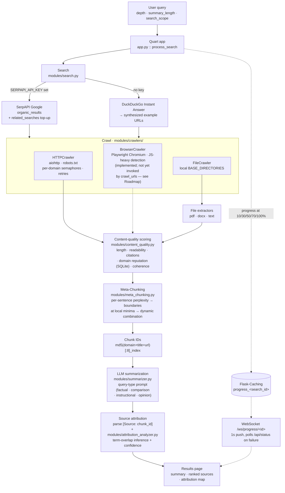
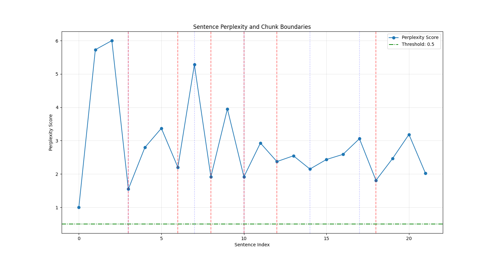

# Eris — real-time, web-grounded answers with quality-scored sources

[](https://github.com/arhammxo/eris/actions/workflows/ci.yml)
[](https://www.python.org/downloads/)
[](LICENSE)

Ask a question, and Eris searches the live web, crawls the results, scores each source for
quality, segments the text at its own logical boundaries, and returns an LLM summary in which
**every claim carries a citation back to the exact chunk it came from**.

> A leaner, test-heavy rewrite of this project lives on the [`v4-rewrite`](https://github.com/arhammxo/eris/tree/v4-rewrite)
> branch. `main` is the original full-stack application described below: an async Quart web app
> with a WebSocket progress UI, a browser crawler, local-file ingestion, and a visual
> attribution map.

---

## Why

An LLM's weights are frozen at its training cutoff, so anything after that date — or anything
too niche to have been memorised — is either missing or confabulated. The usual fix is
retrieval: fetch pages, paste them into the context window, ask for a summary. That works until
it doesn't:

- **Raw pages are mostly noise.** Nav bars, cookie banners, related-articles rails, and comment
  threads all compete for context. Eris extracts main content, then **scores each source** on
  length, readability, citation density, domain reputation, and structural coherence, and ranks
  sources by that score before they reach the model.
- **Fixed-size chunking cuts arguments in half.** Splitting at 4,000 characters severs a claim
  from its evidence, and the model then either drops the claim or hallucinates the missing half.
  Eris uses **perplexity-based Meta-Chunking**: it finds where the text's own predictability
  drops and cuts *there*, so each chunk is a complete thought. See
  [META_CHUNKING.MD](META_CHUNKING.MD).
- **"Here are five links" is not attribution.** Eris assigns every chunk a stable ID, requires
  the model to cite `[Source: <chunk_id>]` inline, then parses those citations back into a
  sentence → chunk map that the UI renders as a clickable attribution grid. A reader can check
  any individual sentence, not just the bibliography.

The payoff: answers that are current, traceable to a specific passage, and ranked so the
best-scoring sources dominate the context window.

---

## Architecture



Every stage is `async`. Sources are crawled concurrently under a global semaphore plus a
per-domain semaphore; per-source processing and file extraction fan out with `asyncio.gather`,
and CPU-bound work (cleaning, sentence ranking, quality scoring) is pushed to threads with
`asyncio.to_thread` so the event loop keeps serving the WebSocket.

The diagram shows the logical order. In code, scoring and chunking both live inside
`process_source`: chunks are produced first, then the source-level quality score is computed and
propagated into each chunk's metadata, and `process_text` finally ranks sources by that score
before the summarizer sees them.

---

## Key modules

| Path | Responsibility |
| --- | --- |
| `app.py` | Quart application: routes, the `process_search` pipeline, WebSocket progress, lifecycle hooks. The canonical entry point. |
| `run.py` | Launcher — CLI flags for host/port/workers/log level, serves via Hypercorn when available, falls back to the Quart dev server. |
| `config.py` | Single `Config` class; every setting reads from the environment with a default. |
| `modules/search.py` | SerpAPI search with related-search top-up; DuckDuckGo and synthesized-URL fallbacks when no key is present. |
| `modules/crawlers/http.py` | Async HTTP crawler: robots.txt checks, rotating user agents, retries/backoff, global + per-domain concurrency limits, main-content extraction. |
| `modules/crawlers/browser.py` | Playwright headless-Chromium crawler with JS-heavy-site detection (known domains + framework markers) and pooled browser instances. |
| `modules/crawlers/file.py` | Local-filesystem crawler over `BASE_DIRECTORIES`, size-capped and extension-filtered. |
| `modules/crawlers/integrated.py` | Orchestrates HTTP + file crawling behind one interface and owns resource cleanup. |
| `modules/file_extractors/` | Pluggable extractors registered by extension — `text` (`.txt .md .csv .json .xml .log`), `pdf` (PyPDF2), `docx` (python-docx). Optional extractors degrade gracefully if the dependency is missing. |
| `modules/content_quality.py` | Five-factor quality score plus a seeded SQLite domain-reputation table. |
| `modules/meta_chunking.py` | `MetaChunker`: local n-gram perplexity, discourse-cue adjustment, boundary detection, dynamic recombination to a target size. |
| `modules/processor.py` | Cleans text, ranks important sentences, chunks, scores each chunk, and attaches per-chunk metadata (position, key terms, word/sentence counts). |
| `modules/summarizer.py` | Query-type detection, per-type system prompts with hard citation rules, the OpenAI call, and citation → chunk resolution. |
| `modules/attribution_analyzer.py` | Turns citations into a sentence → chunk map and infers additional links by term overlap, with confidence scores. |
| `modules/cache.py` | Typed wrapper over Flask-Caching for results and progress records. |
| `modules/utils/` | Structured exception hierarchy with sync/async decorators, JSON-capable logging, markdown rendering, `TypedDict` definitions. |
| `templates/`, `static/` | Search form, live progress page (WebSocket + polling fallback), results page with the attribution grid. |
| `tools/` | `meta_chunking_demo.py` (side-by-side chunking with perplexity plots) and `benchmark_chunking.py` (traditional vs Meta-Chunking timings and size distributions). |

`enhanced_app.py` is a superseded prototype: it imports `modules.crawler`,
`modules.async_processor`, and `modules.async_summarizer`, which no longer exist. It is kept for
history and does not import — use `run.py` or `app.py`.

---

## Quickstart

**Prerequisites** — Python 3.11 (3.8+ works for the library code; CI runs 3.11), an OpenAI API
key for summarization, and optionally a SerpAPI key for real search results.

```bash
git clone https://github.com/arhammxo/eris.git
cd eris

python -m venv .venv
source .venv/bin/activate          # Windows: .venv\Scripts\activate
pip install -r requirements.txt

# Headless browser for JavaScript-heavy sites (optional but recommended)
playwright install chromium

# NLTK corpora. punkt_tab is required by NLTK >= 3.8.2 — without it,
# sentence tokenization raises LookupError at runtime.
python -c "import nltk; nltk.download('punkt'); nltk.download('punkt_tab'); nltk.download('stopwords')"

cp .env.example .env               # then fill in SECRET_KEY and OPENAI_API_KEY
python run.py                      # http://127.0.0.1:5000
```

`run.py` exits if `SECRET_KEY` is unset and warns (but continues) if `OPENAI_API_KEY` or
`SERPAPI_API_KEY` are missing. Useful flags:

```bash
python run.py --host 0.0.0.0 --port 8000 --workers 2 --log-level DEBUG
python run.py --log-file logs/eris.log --structured-logs   # JSON logs
```

Notes:

- **Without `SERPAPI_API_KEY`**, search falls back to the DuckDuckGo Instant Answer API and then
  to synthesized `example_domain/search?q=...` URLs. Those mostly fail to crawl, so treat
  keyless mode as a smoke test, not a demo.
- **Without `playwright install chromium`**, the browser crawler cannot launch. Set
  `USE_BROWSER_CRAWLER=False` to skip it entirely.
- `logs/` and `data/` (which holds the auto-created `domain_quality.db`) are created on startup
  and are git-ignored.

---

## Configuration

All values are read from the environment in `config.py`; see [`.env.example`](.env.example).

### Applied on the request path

| Variable | Default | Purpose |
| --- | --- | --- |
| `SECRET_KEY` | `dev_key_for_development_only` | Quart session signing. **`run.py` refuses to start without it** — override it. |
| `OPENAI_API_KEY` | — | Summarization. Absent ⇒ `ModelAPIError`. |
| `SERPAPI_API_KEY` | — | Real web search. Absent ⇒ fallback search. |
| `CACHE_TYPE` | `SimpleCache` | Flask-Caching backend (e.g. `RedisCache`). |
| `CACHE_DEFAULT_TIMEOUT` | `3600` | Default cache TTL in seconds. |
| `MAX_CONCURRENT_REQUESTS` | `10` | Global crawl concurrency ceiling. |
| `MAX_CONCURRENT_PER_DOMAIN` | `3` | Per-domain politeness limit. |
| `USE_BROWSER_CRAWLER` | `True` | Construct the crawler with browser support. |
| `CHUNK_SIZE` | `4000` | Target chunk size in characters. |
| `USE_META_CHUNKING` | `True` | Meta-Chunking on; `False` ⇒ sentence-packed fixed-size chunks. |
| `META_CHUNKING_THRESHOLD` | `0.5` | Perplexity delta required to open a boundary. |
| `USE_DYNAMIC_COMBINATION` | `True` | Recombine small meta-chunks up to `CHUNK_SIZE`. |
| `USE_OPENAI_FOR_PPL` | `False` | Score perplexity via the OpenAI API instead of the local n-gram model (costs tokens per sentence). |
| `SUMMARY_MODEL` | `gpt-3.5-turbo` | Chat-completions model. |
| `ENABLE_ENHANCED_ATTRIBUTION` | `True` | Run `attribution_analyzer` after summarization. |
| `ENABLE_PROGRESS_TRACKING` | `True` | Write progress records for the WebSocket UI. |
| `BASE_DIRECTORIES` | `~/Documents` | Comma-separated roots for local file search. |
| `MAX_CONCURRENT_EXTRACTIONS` | `5` | Concurrent file extractions. |

### Declared but not yet threaded through

These exist in `config.py` and are documented in `.env.example`, but the code that would consume
them either resolves its own default or is not on the request path. Listed explicitly so the
table stays honest; wiring them is on the roadmap.

| Variable | Default | Where it stops |
| --- | --- | --- |
| `CRAWL_TIMEOUT` | `15` | Read by `create_crawler_from_config()`; `process_search` builds `IntegratedCrawler` directly and gets its `http_timeout=10` default. |
| `RESPECT_ROBOTS_TXT` | `True` | Same as above — the crawler defaults to `True`, so robots.txt *is* honoured, just not configurably from here. |
| `BROWSER_INSTANCES` | `2` | Same as above (`max_browser_instances=2` default). |
| `BROWSER_TIMEOUT` | `30` | Same as above (`browser_timeout=30` default). |
| `MAX_URLS_TO_CRAWL` | `5` | Placed in the search config dict but never read; the search width is `depth × 2`. |
| `MAX_RETRIES` | `3` | `HTTPCrawler` uses its own default. |
| `MAX_TOKENS` | `1000` | The summarizer derives max tokens from `summary_length` (150/300/500). |
| `QUALITY_THRESHOLD` | `0.4` | No filter is applied; sources are *ranked* by quality score instead. |
| `DOMAIN_QUALITY_DB` | `data/domain_quality.db` | `ContentQualityScorer` resolves the path itself (same location). |
| `USER_AGENT` | `Mozilla/5.0 WebSummarizerBot/1.0` | The HTTP crawler rotates a built-in user-agent list. |
| `FILE_SEARCH_ENABLED` | `True` | Only read by `search_combined()`; `process_search` derives file inclusion from `search_scope`. |
| `MAX_FILE_SIZE_MB` | `20` | `FileCrawler` constructor default (same value). |
| `SUPPORTED_FILE_EXTENSIONS` | `.txt,.pdf,.docx,…` | `FileCrawler` constructor default. |
| `ATTRIBUTION_SIMILARITY_THRESHOLD` | `0.6` | `AttributionAnalyzer` is constructed with its own default. |
| `ATTRIBUTION_MIN_CONFIDENCE` | `0.3` | Not read by the attribution path. |

---

## Usage

### Web UI

`GET /` serves the search form: query, **depth** (number of sources, default 3), **summary
length** (`short` / `medium` / `long` → 150 / 300 / 500 max tokens), and **search scope**
(`web` / `files` / `both`). Submitting posts to `/search`, which kicks off a background task and
immediately renders the progress page; that page opens `ws://…/ws/progress/<search_id>`, receives
a status update every second, and navigates to `/results/<search_id>` on completion. If the
socket fails it falls back to polling `/api/status/<search_id>`.

### JSON API

```bash
# Start a search
curl -X POST http://127.0.0.1:5000/api/search \
  -H "Content-Type: application/json" \
  -d '{"query": "quantum error correction 2026", "depth": 3, "summary_length": "medium", "search_scope": "web"}'
```

```json
{
  "search_id": "3f1c…",
  "status": "processing",
  "message": "Search is being processed",
  "poll_url": "/api/status/3f1c…"
}
```

```bash
# Poll until status == "complete"
curl http://127.0.0.1:5000/api/status/3f1c…
```

While running, the status payload carries `status`, `progress` (0–100), `message`, and
`updated_at`. On completion it also returns `query`, `summary` (markdown with inline
`[Source: chunk_id]` citations), `sources` (the source URLs), and `metadata` — which includes
`used_chunks`, `referenced_chunk_ids`, `attribution_mapping`, `query_type`, and `model_used`.

| Route | Method | Purpose |
| --- | --- | --- |
| `/` | GET | Search form |
| `/search` | POST | Form submit → progress page |
| `/results/<search_id>` | GET | Rendered summary, sources, attribution map |
| `/api/search` | POST | Start a search, returns `search_id` |
| `/api/status/<search_id>` | GET | Progress, then the full result |
| `/ws/progress/<search_id>` | WS | Progress pushed every second |

Results are cached for 24 hours; progress records for 1 hour.

---

## Meta-Chunking

Condensed from [META_CHUNKING.MD](META_CHUNKING.MD).

Chunk boundaries decide what the model gets to reason over. Fixed-size splitting ignores
meaning; Meta-Chunking works at a granularity between sentence and paragraph and cuts where the
text itself signals a break.

`modules/meta_chunking.py` implements Perplexity (PPL) Chunking:

1. **Split into sentences** with NLTK.
2. **Score each sentence's perplexity against the running context.** The default path is local
   and API-free: n-grams up to trigrams with Laplace smoothing over a growing context window,
   normalised across the document. Setting `USE_OPENAI_FOR_PPL=True` swaps in API log-probs.
3. **Adjust with discourse cues.** Topic-shift markers (`however`, `in conclusion`, `for
   example`), reported speech, and abrupt sentence-length changes raise the boundary
   probability; continuations (`and`, `but`, `because`) and anaphoric openers lower it.
4. **Cut at local perplexity minima** whose drop exceeds `META_CHUNKING_THRESHOLD`.
5. **Recombine** adjacent meta-chunks up to `CHUNK_SIZE` when `USE_DYNAMIC_COMBINATION=True`, so
   coherent segments still fill the context window efficiently.

The context window is bounded during scoring, keeping memory flat on long documents. Set
`USE_META_CHUNKING=False` to fall back to sentence-packed fixed-size chunks.

Explore it directly:

```bash
pip install colorama matplotlib
python tools/meta_chunking_demo.py                             # writes sample*_perplexity.png
python tools/benchmark_chunking.py --files a.txt b.txt         # timings, chunk-count, size spread
```



---

## Testing

```bash
pytest -q                     # coverage is on by default via pytest.ini
pytest -q --no-cov            # faster, no coverage report
```

Current state on a clean Python 3.11 environment: **9 passed, 5 skipped, 9 xfailed**, 39% line
coverage over `modules/`. No test contacts OpenAI or SerpAPI. (`pytest.ini` also declares
`slow`, `integration`, and `browser` markers; nothing is tagged with them yet.)

The suite predates the current pipeline, and the gap is marked rather than hidden:

- **9 `xfail`s**, each with a reason naming the specific drift — tests that need a Quart app
  context because `meta_chunk_text` reads `current_app.config`; a `clean_text` assertion that
  matches its docstring rather than its regex; a `detect_query_type` pattern that its own `\b`
  boundaries can never match; a crawler mock that hands a non-awaitable to `asyncio.wait_for`;
  and an integrated-crawler test asserting a browser fallback that `crawl_urls` does not
  currently invoke.
- **5 `skip`s** in `tests/test_summarizer.py`, which targets the removed per-source
  summarization API (`summarize_source` / `generate_combined_summary`) that chunk-level
  summarization replaced.

The markers are non-strict, so fixing a test flips it to a pass without breaking the build.
Deliberately, no production code was changed to make tests go green. The rewritten,
test-first suite lives on [`v4-rewrite`](https://github.com/arhammxo/eris/tree/v4-rewrite).

CI ([`.github/workflows/ci.yml`](.github/workflows/ci.yml)) runs on Python 3.11: `ruff check .`,
a smoke import of the whole `modules` package (which eagerly imports the search, crawler,
processing, and summarization stack), then `pytest -q`.

---

## Roadmap

- Wire the browser fallback into `IntegratedCrawler.crawl_urls` — `BrowserCrawler` and
  `_browser_crawl_batch` exist and are tested against, but `crawl_urls` currently returns
  HTTP + file sources only.
- Thread the declared-but-unused config keys (`MAX_RETRIES`, `MAX_TOKENS`, `USER_AGENT`,
  `DOMAIN_QUALITY_DB`, `MAX_FILE_SIZE_MB`, `SUPPORTED_FILE_EXTENSIONS`, `ATTRIBUTION_*`) through
  to the objects that need them, and enforce `QUALITY_THRESHOLD` as an actual filter.
- Replace the term-overlap attribution fallback with embedding similarity, and calibrate the
  confidence scores against a labelled set.
- Rewrite the legacy tests against the current API and retire the `xfail`/`skip` markers.
- Adaptive perplexity thresholds and HTML-structure awareness in Meta-Chunking (headings and
  sections as boundary priors).
- Redis-backed cache and a task queue so results survive a restart and scale past one process.
- Retire `enhanced_app.py`.

---

## License

MIT — see [LICENSE](LICENSE).
